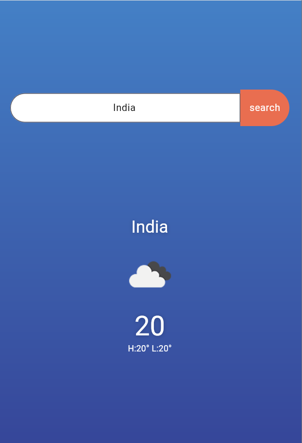

# **Weather App**
A simple weather application built using Flutter that fetches and displays current weather information for a given city. This project was created as part of an internship application test.

### **Features**
Home screen with a search bar to enter a city name
Weather details screen to display:
City name
Current temperature (in Celsius)
An icon representing the weather condition
Loading indicator while fetching data
Proper error handling for API requests with user-friendly error messages
State management using Provider
Basic responsive design for mobile and tablet devices
Refresh button on the weather details screen to fetch updated weather data
Data persistence to save the last searched city


### **Screenshots**




### **Installation**
> Clone the repository:
```console
git clone https://github.com/your-username/weather_app.git
cd weather_app
```

> Install dependencies:
Copy code
```console
flutter pub get
```

> Run the app:
```console
flutter run
```


### **Usage**
The main screen has a search bar which is used to search city or country, which will  tells us about the current weather and we can even search any city or country needed to check the weather of the following country or city.


### **Dependencies**

flutter: The Flutter framework.
http: For making HTTP requests.
provider: For state management.
shared_preferences: For data persistence.
riverpood:For advance state management.


[def]: image.png